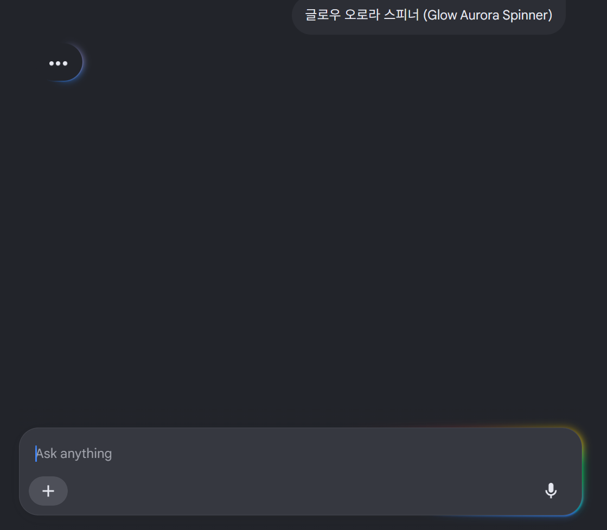

# R-005: Chat and Inline UX/UI, Motion, and Theme Isolation Report

> [!IMPORTANT]
> **Status: Verified / Mandatory planning input**
>
> Any broad Smart Composer visual redesign, chat-shell rewrite, streaming
> renderer change, or native inline-edit plan must read this report together
> with R-001 through R-004.
>
> **Design decision addendum: 2026-07-23**
>
> The user approved a deliberately asymmetric dual-personality direction:
> **Hallym Conversation Studio** for light mode and **CMDS AI Operator
> Console** for dark mode. Section 8 records the detailed decision.

## 1. Executive Summary

The user's design instinct is sound, but several names and implementation
assumptions needed correction.

The desired Smart Composer experience is best described as:

```text
quiet, highly readable productivity shell
  + an unmistakable but restrained AI activity signature
  + progressive response rendering
  + the same state language in chat and inline editing
```

A later design review refined "quiet" into two intentionally different
presentational personalities:

```text
Light:
  Hallym Conversation Studio
  calm, open, familiar web-AI conversation and writing

Dark:
  CMDS AI Operator Console
  explicit terminal/operator character, denser operational feedback,
  and a stronger neon-green activity language
```

This is not a conventional light/dark inversion. The light skin should resemble
a polished general-purpose AI conversation product, while the dark skin should
deliberately provide the sense of operating an advanced AI system. The dark
terminal character is therefore a product decision, not an accidental styling
failure.

The two personalities must still share the same interaction model, information
truth, keyboard behavior, safety checks, and control positions. A skin change
must not force the user to relearn Smart Composer.

The strongest reference blend is:

- **Google AI Mode** for a distinctive active/thinking state, a bottom composer,
  and visible movement from prompt to response;
- **Microsoft 365 Copilot** for progressive disclosure, a prompt surface that
  expands into a task workspace, contextual controls, and a close connection
  between chat and the document being edited;
- **ChatGPT** for quiet default surfaces, response readability, restrained
  message chrome, and contextual tools that do not dominate the transcript.

The phrase **"Glow Aurora Spinner"** is not a verified Google component name or
an established industry-standard term. The user's captured indicator is more
accurately described as a **branded indeterminate activity indicator**, with a
visual subtype resembling a **three-dot orbital loader with a luminous gradient
trail**. "Aurora" remains a useful internal visual nickname, not a claim about
Google's design-system vocabulary.

Similarly, **streaming** must be separated into two layers:

1. **Transport and generation**: token or chunk delivery through a stream, which
   may use Fetch streams, SSE, or another provider transport.
2. **Presentation**: progressive response reveal, smooth chunk streaming, or a
   short fade/settle animation at the stream head.

SSE is not the visual effect, and a classic typewriter animation is not the same
thing as genuine model streaming.

The user's observation that polished motion can make unchanged model latency
feel faster is also technically well grounded. MDN defines perceived
performance as how fast, responsive, and reliable a product *feels*, and
recommends immediate acknowledgement plus regular status updates instead of
silence. The redesign should therefore treat motion as operational feedback,
not decoration.

The current Smart Composer 1.4.0 UI is not ready for that motion layer:

- it has no Shadow DOM or equivalent style boundary;
- its stylesheet references 78 distinct host variables in 535 declarations;
- Radix portals can escape the plugin root into `document.body`;
- the current query state is plain text plus a changing `...` pseudo-element;
- each streaming content update can clear and rerender the complete Obsidian
  Markdown subtree.

Adding per-character animation on top of the current renderer would likely make
the interface feel less polished. The streaming render path must be stabilized
before adding visual motion.

The user's requirement that the custom skin **must not be changed by Obsidian
community themes** has an important architectural consequence:

- class prefixes, custom properties, `@layer`, and `isolation: isolate` can make
  the UI theme-resistant;
- they cannot guarantee encapsulation against arbitrary global selectors or
  `!important`;
- a strong guarantee requires a Shadow DOM boundary or an equivalent isolated
  document.

For this plugin, a Shadow DOM prototype is feasible but must pass explicit
compatibility gates for Obsidian Markdown rendering, internal links, Lexical,
Radix portals, pop-out windows, and editor-anchored inline UI. If the project
rejects Shadow DOM, the honest product claim must be "hardened fixed skin," not
"unaffected by every Obsidian theme."

## 2. Scope and Evidence Labels

This investigation combines source inspection, official product documentation,
accessibility/performance guidance, and the user's captured reference.

Evidence labels used below:

- **Verified - source**: confirmed in Smart Composer 1.4.0 source.
- **Verified - official documentation**: stated in first-party documentation.
- **User observation**: shown or described by the user, but not reproduced in a
  controlled session on every product surface.
- **User-approved design decision**: a direction explicitly selected by the
  user for the custom build; authoritative as product intent, but still subject
  to prototype and accessibility validation.
- **Inference**: an engineering or design conclusion derived from verified
  evidence.
- **Proposal**: a candidate specification reserved for later implementation
  planning.

### Verified in this investigation

- Smart Composer 1.4.0 chat composition, progress, portal, Markdown, and stream
  update paths.
- The current degree of dependence on Obsidian theme variables.
- The absence of a dedicated streaming-text animation layer.
- Google's official explanation that AI Mode intentionally uses dynamic
  elements to show that the system is thinking.
- Microsoft's official 2026 design principles for the Microsoft 365 Copilot
  prompt surface, output readability, progressive disclosure, in-document
  invocation, and first-token performance.
- The user's supplied Hallym Light and CMDS Dark Obsidian palette notes,
  including the official Hallym navy/blue/teal values and the CMDS black,
  charcoal, gray, and neon-green values.
- WCAG contrast calculations for the primary palette pairs recorded in section
  8.3.
- Official definitions and constraints for indeterminate progress indicators,
  Acrylic, Shadow DOM, reduced motion, forced colors, live regions, and
  perceived performance.
- The user's reference image contents and dimensions.

### Not verified in this investigation

- The exact private implementation or official internal name of Google's
  three-dot thinking animation.
- Pixel-perfect timing, easing, or color values used by the current Google AI
  Mode production client.
- A live DOM/CSS extraction from Google AI Mode, consumer Copilot, or ChatGPT.
- Whether every Obsidian Markdown postprocessor works inside a ShadowRoot.
- Whether the user's favorite consumer Copilot surface uses Windows Acrylic,
  a web `backdrop-filter`, an opaque approximation, or a different material.
- Final visual acceptance on desktop, mobile, and multiple community themes.

These unverified items must remain prototype and visual-QA tasks. They are not
facts to be silently assumed in a future roadmap.

## 3. User Reference Artifact

The user's captured reference has been preserved here:



Observed elements:

- a nearly black neutral background;
- a three-dot white cluster near the upper-left response origin;
- a partial blue/cyan luminous orbit or trail around that cluster;
- a large bottom composer with a mostly opaque dark surface;
- a very thin spectral glow concentrated around the lower and right perimeter;
- plus and microphone controls with minimal labels;
- substantial empty space, making the active indicator highly legible.

This reference should not be reduced to "put a purple gradient spinner in the
corner." Its impact comes from contrast between a quiet screen and a very small
active signal.

## 4. Terminology Corrections

### 4.1 Loading indicator

| Phrase | Accuracy | Recommended use |
| --- | --- | --- |
| Glow Aurora Spinner | Descriptive nickname, not verified standard terminology | Internal visual direction only |
| Aurora Glow Loop | Descriptive nickname | Avoid in public technical claims |
| Gradient Infinite Spinner | Understandable but non-canonical | CSS prototype description |
| Indeterminate progress indicator | Standard general term | Use when duration/progress is unknown |
| Activity indicator | Standard general term | Use for short asynchronous work |
| Branded AI activity indicator | Accurate product-design description | Preferred report terminology |
| Three-dot orbital loader with luminous trail | Accurate description of the captured visual | Preferred visual subtype |

Apple and Material documentation use **progress indicator**, **activity
indicator**, **circular progress indicator**, and **indeterminate**. Google says
AI Mode contains dynamic elements that show it is thinking, but the public
article does not name the element "Glow Aurora Spinner."

### 4.2 Streaming

| Layer | Accurate terms | What it is not |
| --- | --- | --- |
| Provider/network | token stream, chunk stream, Fetch `ReadableStream`, SSE | a CSS animation |
| Client buffering | chunk smoothing, word buffering, frame batching | model reasoning |
| Visual presentation | progressive response reveal, smooth stream-head animation, animated per-word streaming | necessarily a typewriter |
| Artificial playback | typewriter effect | proof that content is arriving live |

A future implementation should not deliberately delay already available text
just to imitate a typewriter. It may smooth highly irregular provider chunks,
but user-visible output must never be slower merely for spectacle.

### 4.3 Glass and material

The user's phrase "Copilot glass" is a useful visual reference, but should not
be treated as proof that a particular Copilot web surface uses Microsoft's
Windows Acrylic material.

Microsoft defines Acrylic as a translucent, blurred, tinted texture. Its own
guidance says:

- prefer it on transient surfaces such as menus and flyouts;
- avoid large background surfaces and adjacent Acrylic panes;
- provide opaque fallbacks;
- account for GPU and battery cost;
- preserve text contrast.

For Smart Composer, the more accurate direction is:

```text
mostly opaque layered surface
  + subtle translucency where supported
  + thin highlight and small active perimeter accent
```

The transcript background should not become a large frosted panel.

## 5. Reference Product Findings

### 5.1 Google AI Mode: what is actually useful

Google's official AI Mode design article says the product:

- is a redesigned Search interface for complex and follow-up questions;
- was shaped through user research and testing;
- places the search/composer surface at the bottom for follow-up;
- uses helpful links to encourage exploration;
- intentionally signals that the experience is new and special;
- includes dynamic elements to show that Google is thinking.

Source:
[How Google developed the design for AI Mode in Search](https://blog.google/products-and-platforms/products/search/ai-mode-development/)

**Absorb**

- An immediate, recognizable state after submit.
- A stable response origin so the user's eye knows where output will begin.
- A bottom composer that remains available for continuation.
- A visible handoff from thinking to first response.
- Motion concentrated around active work, not spread across the whole screen.

**Do not copy**

- Google brand colors or exact logo-adjacent animation.
- Search-result density, link layouts, or consumer search affordances that do
  not fit an Obsidian writing tool.
- A giant mobile-first pill copied at desktop-sidebar scale.
- The visual implication that a decorative animation proves deeper reasoning.

### 5.2 Microsoft 365 Copilot: what is actually useful

Microsoft's May 2026 design article is unusually direct:

- the prompt line became a task-aware workspace;
- tools and controls appear below it in context;
- the interface uses progressive disclosure;
- the prompt surface can expand for larger structured input;
- output tone, structure, readability, usefulness, and trustworthiness are part
  of the UX;
- Copilot can be invoked in a side pane or directly on the document canvas;
- clear signals should show what it is doing;
- visual craft and actual performance must be designed together.

Microsoft also reports measuring Chat First Token Response and a roughly 10%
P95 improvement in a controlled comparison. This is important: the official
design story does not claim that animation replaces latency work.

Source:
[Introducing a new design for Microsoft 365 Copilot](https://www.microsoft.com/en-us/microsoft-365/blog/2026/05/28/introducing-a-new-design-for-microsoft-365-copilot/)

**Absorb**

- Progressive disclosure instead of exposing every mode at once.
- A composer that grows when the task grows.
- Tools grouped by the current task.
- One consistent invocation language across sidebar chat and inline editing.
- Clear document-context signals.
- Output readability as a primary design surface.
- Instrumented real performance, especially time to first visible response.

**Do not copy**

- A full Microsoft 365 navigation shell.
- Enterprise-agent complexity.
- Large card grids and suggestion galleries inside a narrow Obsidian pane.
- Heavy translucent materials across every persistent surface.

### 5.3 ChatGPT: what is actually useful

OpenAI publishes product help and screenshots rather than a public complete
ChatGPT visual design specification. Current official material verifies:

- light/dark/system visual preferences and accent color;
- one composer with a contextual tool menu;
- projects that gather files, instructions, and chats;
- Canvas selection-based inline requests and applyable suggestions.

Sources:

- [Updating your visual experience on ChatGPT](https://help.openai.com/en/articles/11958281)
- [Projects in ChatGPT](https://help.openai.com/en/articles/10169521-using-connectors-in-chatgpt)
- [Canvas in ChatGPT](https://help.openai.com/en/articles/9930697-what-is-the-canvas-feature-in-chatgpt-and-how-do-i-use-it)

**Absorb**

- Low-noise response chrome.
- Strong typography and generous line-height.
- Actions that appear near the content they affect.
- A single composer whose secondary capabilities remain contextual.
- Inline selection as the start of an edit request.

**Do not copy**

- OpenAI branding, proprietary visual assets, or product-specific wording.
- ChatGPT's entire navigation model.
- A second document editor when Obsidian already is the editor.

### 5.4 The appropriate hybrid

The user's preferred hybrid can be stated as:

```text
Base layer:
  ChatGPT / Microsoft 365 Copilot restraint and readability

Composer behavior:
  Copilot-style expandable task surface and progressive disclosure

Active-state signature:
  Google AI Mode-inspired orbital activity indicator and perimeter accent

Editing:
  Claudian-inspired anchored inline workflow from R-002

Artifacts and long operations:
  phase-specific state language from R-001, R-003, and R-004
```

This is not "static minimalism plus cyberpunk." A better design rule is:

> Quiet at rest, visibly alive while working, quiet again when complete.

## 6. Current Smart Composer 1.4.0 UI Audit

### 6.1 Version and files inspected

Repository release:

```text
tag: 1.4.0
commit: e844009fa136b94ac8f496fe28f92d43c89dc365
```

Primary paths:

```text
src/ChatView.tsx
src/components/chat-view/Chat.tsx
src/components/chat-view/QueryProgress.tsx
src/components/chat-view/AssistantMessageContent.tsx
src/components/chat-view/ObsidianMarkdown.tsx
src/components/chat-view/useChatStreamManager.ts
src/components/chat-view/chat-input/ChatUserInput.tsx
src/components/chat-view/chat-input/ModelSelect.tsx
src/components/chat-view/ChatListDropdown.tsx
src/components/common/DotLoader.tsx
src/components/common/SplitButton.tsx
styles.css
```

### 6.2 Current shell

`ChatView` creates a React root directly in the normal Obsidian DOM:

```text
this.containerEl.children[1]
  -> React root
  -> Chat
```

There is no ShadowRoot. The shell contains:

- a compact header with new/history/template controls;
- a scrolling message column;
- a persistent `ChatUserInput`;
- an absolute stop-generation button;
- query progress inserted at the end of the transcript.

The functional structure is reasonable. The missing layer is a deliberate
visual system and state choreography.

### 6.3 Theme dependence

The 1.4.0 stylesheet contains:

```text
78 unique var(--...) references
535 lines containing var(--...)
```

Most are Obsidian theme variables such as:

```text
--background-primary
--background-modifier-form-field
--background-modifier-border
--text-normal
--text-muted
--font-ui-small
--radius-s
--interactive-accent
```

That is consistent with Obsidian's official recommendation for plugins that
want to look native across community themes. It is the opposite of the user's
new requirement for a visually fixed custom product skin.

Source:
[Obsidian developer documentation: About styling](https://docs.obsidian.md/Reference/CSS%20variables/About%20styling)

### 6.4 Style leakage and portal escape

The stylesheet includes weakly scoped or global names:

```text
.obsidian-default-textarea
.spinner
@keyframes spin
@keyframes fadeIn
```

Several Radix dropdowns and popovers use `Portal` without passing a plugin-local
container. By default, those surfaces can be mounted under `document.body`,
outside any root selector used to stabilize the chat skin.

Consequences:

- a community theme can style plugin buttons, inputs, lists, and popovers;
- plugin styles can collide with other plugins;
- a future ShadowRoot will not automatically style escaped portals;
- pop-out windows require document-local portal and event handling.

### 6.5 Current progress feedback

`QueryProgress.tsx` contains a `TODO: Update style`. It renders states such as:

```text
Reading mentioned files...
Indexing ...
Querying the vault...
Selecting relevant chunks...
Reading related files...
```

`DotLoader` is implemented by changing pseudo-element content through:

```text
'' -> '.' -> '..' -> '...'
```

This provides basic feedback but has several weaknesses:

- no branded state identity;
- no stable indicator width unless explicitly reserved;
- no visual handoff into response streaming;
- no shared language with inline edit or image generation;
- limited semantic status behavior for assistive technology.

### 6.6 Current stream rendering

The response subscription updates React state whenever the response generator
emits. `AssistantMessageContent` reparses the full accumulated content.
`ObsidianMarkdown` then:

1. clears `containerRef.current.innerHTML`;
2. invokes `MarkdownRenderer.render()` with the full accumulated string;
3. rewires internal links.

This is suitable for settled Obsidian Markdown fidelity, but it is a poor base
for per-word entrance animation. Frequent clearing and rerendering can:

- repaint already stable content;
- make code blocks and tables flicker;
- repeatedly run Markdown processing;
- interfere with selection;
- increase scroll work;
- make a glow/fade effect appear uneven even when the model stream is healthy.

**Mandatory implementation implication:** stabilize or split the streaming
renderer before adding animated stream-head text.

### 6.7 No motion-library requirement

The release has React, Lexical, Radix, Lucide, and Obsidian renderers, but no
Framer Motion dependency. The target motion can be implemented with:

- CSS transitions/keyframes for opacity and transform;
- a small React state machine;
- `requestAnimationFrame` for buffered stream flushes;
- an optional Web Animations API helper.

Adding a large motion framework is not justified by the required effects alone.

## 7. Product Design Thesis

### 7.1 Core experience

Smart Composer should feel like a writing instrument, not a marketing page and
not a full-screen AI portal.

The target character is:

- calm;
- precise;
- literate;
- fast to scan;
- visibly responsive;
- technically advanced without constant spectacle.

### 7.2 Perceived performance is a real product property

MDN describes perceived performance as how fast, responsive, and reliable a
product feels. It recommends a quick acknowledgement and ongoing status rather
than waiting silently for a complete operation.

Source:
[MDN: Perceived performance](https://developer.mozilla.org/en-US/docs/Learn_web_development/Extensions/Performance/Perceived_performance)

The user's "it may not actually be faster, but it feels like a premium and
advanced tool" requirement therefore has three legitimate functions:

1. **Interaction acknowledgement**: the click or Enter was received.
2. **State comprehension**: the system is reading, selecting context, waiting
   for a model, streaming, applying, or saving.
3. **Product confidence**: transitions appear controlled rather than accidental.

It becomes deceptive only if it:

- shows fake progress;
- hides a stall;
- delays available output;
- claims reasoning stages that are not actually known;
- replaces real latency and jank work.

### 7.3 Visual hierarchy

The active AI accent should occupy a very small fraction of the viewport.

Recommended hierarchy:

```text
1. Generated/edited content
2. Current input or selected edit target
3. Truthful operation status
4. Primary action
5. Secondary controls
6. Decorative accent
```

The gradient is level 6 except while it carries level-3 status.

## 8. Proposed Visual System for Later Planning

This section includes a user-approved product direction plus candidate
production values. Exact shades, animation timings, and density still require
prototype screenshots and real-device QA.

### 8.1 Approved dual-personality thesis

The custom Smart Composer should ship as one product with two deliberately
different visual personalities:

| Dimension | Hallym Conversation Studio | CMDS AI Operator Console |
| --- | --- | --- |
| Color mode | Light | Dark |
| Primary impression | Polished web-AI conversation and writing | Advanced terminal/operator workspace |
| Reference character | ChatGPT/Copilot restraint and Google active-state motion | Modern coding console and AI operations surface |
| User posture | Read, ask, write, revise | Invoke, inspect, operate, apply |
| Information density | Relaxed and progressively disclosed | Denser operational telemetry |
| Dominant accent | Hallym navy, blue, and teal | CMDS neon green with Hallym teal/blue trail |
| Motion character | Smooth, calm, fluid handoff | Precise, responsive, signal-like |
| Prose typography | Sans-serif | Sans-serif |
| Metadata typography | Sans-serif or restrained mono | Monospace-forward |
| Default surface | Bright, opaque, open | Black/charcoal, layered, instrument-like |

The design statement is:

> Light is a place where a person converses and writes with AI. Dark is a place
> where a person operates an AI system.

This distinction intentionally embraces the attraction of terminal-centered AI
workflows. The feeling of direct system operation can increase focus,
confidence, and perceived capability even when the underlying model is
unchanged. This is a legitimate experience goal as long as the UI does not
invent fake system phases or hide real latency.

The earlier R-005 rule remains valid, but is now interpreted per personality:

```text
Light:
  quiet at rest -> softly alive while working -> quiet after completion

Dark:
  instrument-ready at rest -> visibly operational while working
  -> settled console after completion
```

### 8.2 Invariants across both personalities

The two skins may differ in atmosphere and information density, but they are
not separate applications.

The following must remain invariant:

- composer location and basic dimensions;
- model, tool, mention, image, send, and stop control locations;
- keyboard shortcuts and Korean IME behavior;
- focus order, accessible names, and touch target sizes;
- retrieval, tool, generation, error, cancellation, and completion semantics;
- inline-edit anchoring, preview, Apply, Reject, and stale-range safety;
- message order and conversation history behavior;
- truthful phase labels;
- the meaning of every status color;
- cancellation and recovery behavior;
- stable source text and stable transcript origin;
- no loss of content or scroll position when switching skin.

Allowed differences include:

- spacing density within defined responsive limits;
- default visibility of nonessential telemetry;
- typography used for metadata;
- border, glow, trail, and focus treatments;
- transition timing within the motion budget;
- the intensity and spatial reach of the active accent;
- how strongly the composer resembles a conversation surface or command deck.

Implementation should prefer one semantic component tree and one state machine
with skin-owned tokens and presentation variants. Forking business logic by
skin would create unnecessary regressions.

### 8.3 Palette evidence and contrast constraints

The user supplied two local design notes:

```text
옵시디언 Minimal Theme setting (Style settings) -
안창현 Hallym Light × 구요한 CMDS Dark 듀얼 컬러 스킨.md

한림대 로고 키 컬러 코드 6자리.md
```

The verified Hallym key colors are:

| Role | Value |
| --- | --- |
| Deep navy | `#002E6E` |
| Primary blue | `#0066B3` |
| Teal blue | `#00B5AD` |

The user's current Hallym Light Obsidian settings also use:

| Role | Value |
| --- | --- |
| App accent | `#0A85F0` |
| White base | `#FFFFFF` |
| Light selected surface | `#C3DBEF` |
| Heading/navy family | `#00102E`, `#001D53`, `#00328D`, `#0140B2` |

The verified CMDS Dark settings use:

| Role | Value |
| --- | --- |
| Absolute base | `#000000` |
| Canvas | `#0A0A0A` |
| Primary raised surface | `#141414` |
| Secondary/code surface | `#1F1F1F` |
| Neon accent | `#B6FF00` |
| Primary body text | `#D4D4D4` |
| Structural gray | `#333333` |
| Secondary icon/text gray | `#888888` |
| Dark neon highlight fill | `#334C00` |

Calculated WCAG contrast ratios:

| Foreground | Background | Ratio | Design implication |
| --- | --- | ---: | --- |
| `#002E6E` | `#FFFFFF` | 13.00:1 | Strong heading and text color |
| `#0066B3` | `#FFFFFF` | 5.91:1 | Suitable for normal text and controls |
| `#00B5AD` | `#FFFFFF` | 2.56:1 | Do not use as the sole small-text or control-boundary signal |
| `#0A85F0` | `#FFFFFF` | 3.73:1 | Suitable for large/UI emphasis, not default small body text |
| `#B6FF00` | `#0A0A0A` | 16.30:1 | Extremely strong active/heading signal |
| `#B6FF00` | `#141414` | 15.17:1 | Extremely strong active/heading signal |
| `#D4D4D4` | `#0A0A0A` | 13.36:1 | Strong dark-mode body text |
| `#888888` | `#0A0A0A` | 5.58:1 | Suitable muted text where size remains readable |
| `#00B5AD` | `#0A0A0A` | 7.74:1 | Strong dark-mode secondary signal |
| `#0066B3` | `#0A0A0A` | 3.35:1 | Use for graphics/large emphasis, not small dark-mode text |

The contrast table changes color roles:

- Hallym teal is a strong motion and graphical accent on dark surfaces.
- Hallym teal must be paired with navy/blue or a darker outline on white.
- CMDS neon has enough contrast for text, but its visual intensity means
  hierarchy, not legibility, is the limiting factor.
- The current `#0A85F0` app accent can remain a candidate focus/caret color, but
  the official `#0066B3` should be the default prototype action blue.

### 8.4 Hallym Conversation Studio specification

The light skin should feel immediately familiar to users of polished web AI
products while retaining a recognizable Hallym identity.

Candidate owned tokens:

| Token role | Candidate |
| --- | --- |
| Canvas | `#F7F9FC` |
| Primary surface | `#FFFFFF` |
| Secondary surface | `#F0F5FA` |
| Selected surface | `#C3DBEF` |
| Border | `#D7E1EC` |
| Primary text | `#00102E` |
| Secondary text | `#526174` |
| Strong heading | `#002E6E` |
| Action/focus | `#0066B3` |
| Optional bright focus/caret | `#0A85F0` |
| Motion accent | `#00B5AD` |

Visual behavior:

- assistant responses remain mostly unframed;
- user messages may use a restrained tinted surface, not a heavy bubble;
- the transcript prioritizes reading width and line-height;
- the composer is mostly opaque white with a cool-gray border;
- shadows remain shallow and neutral;
- the Hallym triad appears primarily in focus, selection, loader, and active
  perimeter states;
- advanced tool and retrieval telemetry is progressively disclosed;
- status copy uses normal conversational language;
- completed responses return to a quiet document-like appearance.

The light skin must not become:

- a permanent blue header wrapped around every surface;
- a collection of blue cards;
- a generic purple-gradient AI interface;
- a large glass panel over a white background;
- a direct pixel copy of ChatGPT, Copilot, or Google AI Mode.

### 8.5 CMDS AI Operator Console specification

The dark skin should intentionally and recognizably feel like a modern terminal
or AI operations console. This is not a warning condition. It is the selected
product identity.

Candidate owned tokens:

| Token role | Candidate |
| --- | --- |
| Absolute frame | `#000000` |
| Canvas | `#0A0A0A` |
| Primary surface | `#141414` |
| Secondary/raised surface | `#1F1F1F` |
| Border/rail | `#333333` |
| Primary prose | `#D4D4D4` or visually tested `#E8EAED` |
| Muted metadata | `#888888` |
| Active signal | `#B6FF00` |
| Active fill | `#334C00` or a lower-alpha neon equivalent |
| Secondary signal | `#00B5AD` |
| Trail terminus | `#0066B3` |

Terminal character should come from:

- deep black and charcoal surface separation;
- compact but readable status lanes;
- visible retrieval/tool/generation phases;
- precise alignment and stable columns;
- monospace model IDs, file counts, tool names, durations, and technical
  metadata;
- neon-green active rails, focus, selected model, and current operation;
- a luminous green-to-teal-to-blue activity trail;
- compact icon controls with tooltips;
- persistent availability of Stop during active work;
- settled responses that remain readable after the operation ends.

Long Korean prose, Markdown explanations, and generated documents should remain
in the shared sans-serif reading face. Making every answer monospace or neon
green would reduce reading quality and make the terminal character feel like a
costume.

The dark skin may expose more operational detail by default than the light
skin, including:

- current provider/model;
- retrieval mode;
- number of files or chunks processed;
- current tool phase;
- image save/upload phase;
- elapsed time after a sensible threshold;
- fallback or recovery state.

These details must be real. Do not add fake shell commands, fabricated token
counts, invented reasoning phases, or decorative logs that imply work that did
not happen.

### 8.6 Neon hierarchy

The earlier recommendation to keep neon spatially small is refined, not
discarded. The CMDS skin may use neon more broadly than the light skin, but it
must use a hierarchy.

#### Full-intensity neon

Use `#B6FF00` for:

- current operation and orbital loader;
- focused composer edge or caret;
- selected model or active mode;
- primary active icon;
- compact H1/H2 response headings where visual QA confirms readability;
- current inline-edit range edge;
- current tool or retrieval phase;
- success confirmation before it settles.

#### Reduced-intensity neon

Use a mixed or lower-alpha neon for:

- hover outlines;
- inactive rails adjacent to an active operation;
- selected-row backgrounds;
- code or metadata separators;
- tag backgrounds;
- settled success history.

#### Neutral content

Keep these neutral:

- body paragraphs;
- long lists;
- tables;
- ordinary filenames after completion;
- inactive controls;
- timestamps;
- settled assistant messages.

The goal is an explicit terminal interface, not a monochrome CRT recreation.
Avoid scanlines, fake phosphor noise, constant flicker, and full-screen bloom.

### 8.7 Dual orbital-loader specification

Both skins use the same semantic activity component and the same state
transitions. Their presentation differs.

Shared geometry:

```text
chat size: 16 x 16px
inline size: 12 x 12px
orbit stroke: approximately 1.5px
dot diameter: 2-3px
glow radius: no more than 4-6px
active dots: three
```

Hallym light trail:

```text
#002E6E -> #0066B3 -> #00B5AD -> transparent
```

Suggested character:

- approximately `1.1-1.2s` cycle;
- smooth ease or gently eased linear motion;
- deep-navy/blue dots;
- soft teal tail;
- low-opacity glow;
- calm crossfade into the first streamed text.

CMDS dark trail:

```text
#B6FF00 -> #00B5AD -> #0066B3 -> transparent
```

Suggested character:

- approximately `0.9-1.0s` cycle;
- more linear and mechanically precise motion;
- off-white or neon-leading dots;
- a clearer short luminous trail;
- slightly stronger glow than light mode, still bounded to the indicator;
- compression into a neon stream-head point when first content arrives.

The difference in timing must not imply different model performance. Both
skins must acknowledge submit within the same real latency budget.

### 8.8 Streaming presentation by personality

Transport, buffering, and renderer architecture remain shared.

Hallym light presentation:

- new word groups or semantic chunks settle by opacity plus `1-2px` movement;
- candidate settle duration: `140-180ms`;
- the stream head uses blue/teal briefly, then becomes normal text;
- completed blocks become fully static;
- actions appear only after a block is stable.

CMDS dark presentation:

- new chunks use a slightly shorter `110-160ms` settle;
- the stream head may retain a tiny neon point or edge;
- technical tool output may reveal by stable line or block;
- ordinary prose still settles into neutral body text;
- no character-by-character fake playback;
- no persistent glow on already generated paragraphs.

The dark skin may feel faster, but the implementation must never hold light-mode
text longer or delay either skin for visual theater.

### 8.9 Composer and transcript treatment

#### Hallym light composer

- opaque white base;
- one-pixel cool border;
- modest radius, avoiding an oversized pill at desktop widths;
- shallow shadow or inner highlight;
- tools revealed progressively;
- active perimeter light concentrated on a small lower/right segment;
- Hallym blue primary action;
- teal used as a transient completion or motion bridge.

#### CMDS dark command deck

- `#141414` or `#1F1F1F` base over the `#0A0A0A` canvas;
- structural `#333333` border;
- a compact status rail that does not change composer height;
- neon-green focus and active-operation edge;
- more visible model/tool/retrieval metadata;
- Hallym teal/blue used in the moving tail so dark and light remain one brand
  family;
- no large animated blur around the entire composer.

The composer may look different, but the send, stop, add/attach, model, mention,
and tool controls must stay in corresponding positions.

#### Transcript

In both skins:

- assistant output remains the dominant visual object;
- message content is not nested inside multiple cards;
- code, tables, callouts, references, and tool results receive stable reserved
  dimensions;
- the response origin does not move when the loader hands off to text;
- scrolling up disables forced auto-follow until the user returns to the end.

### 8.10 Inline-edit adaptation

The inline interface uses the same dual personality at smaller scale.

Hallym light:

- white anchored prompt surface;
- blue focus and selection language;
- a 12px navy/blue/teal orbital loader;
- light-blue edit-range wash;
- clear but quiet diff edges;
- Apply/Reject actions that feel like document editing controls.

CMDS dark:

- black/charcoal anchored command strip;
- neon-green active range rail;
- a 12px green/teal/blue orbital loader;
- monospace technical state metadata;
- compact Apply/Reject controls;
- a short neon settle when a diff becomes ready.

Shared requirements:

- selected source text does not move, pulse, blur, or glow continuously;
- the floating surface must not cover the edit target when another placement is
  available;
- Enter/Esc behavior remains identical;
- Korean IME composition remains safe;
- stale-document validation is never bypassed for animation;
- the user can cancel before first output and during streaming;
- reduced motion replaces rotation with a static state mark and phase text.

### 8.11 Typography

Use a local system stack:

```css
font-family:
  "Segoe UI Variable",
  "Segoe UI",
  system-ui,
  -apple-system,
  BlinkMacSystemFont,
  "Malgun Gothic",
  sans-serif;
```

Do not fetch remote fonts. Do not use negative letter spacing. Markdown reading
width, line-height, code font, and heading scale should be owned by plugin
tokens rather than community-theme heading variables.

CMDS metadata can use the local system monospace stack:

```css
font-family:
  "Cascadia Mono",
  "Cascadia Code",
  "Consolas",
  ui-monospace,
  monospace;
```

Use monospace for operational metadata, model identifiers, tool states, counts,
and code. Do not use it for all Korean prose.

### 8.12 Shape and depth

- Use 8px or less for cards and framed tool surfaces.
- Do not make every message a card.
- Keep assistant output mostly unframed.
- Use one persistent composer surface, not nested cards.
- Prefer one-pixel borders and restrained shadows.
- Use translucency as progressive enhancement, not the only source of contrast.
- Reserve glow for active edges and the activity indicator.

The dark skin may be more rectilinear and compact than the light skin, but
shared controls must keep stable hit areas and recognizable geometry.

### 8.13 Control language

- Lucide icons for familiar commands.
- Tooltips for unfamiliar icons.
- Segmented controls for real mode choices.
- Menus for model/tool lists.
- Toggles for binary settings.
- Text buttons only for explicit commands such as Apply, Retry, or Stop.

### 8.14 Skin ownership and mode resolution

Theme independence does not require a colorless or generic interface. It means
Smart Composer owns the values.

Candidate root contract:

```text
data-smtcmp-skin="hallym-light"
data-smtcmp-skin="cmds-dark"
```

Candidate setting:

```text
Skin:
  Follow Obsidian light/dark mode
  Hallym Conversation Studio
  CMDS AI Operator Console
```

When following Obsidian mode, the host supplies only the light/dark selection.
It must not supply the actual visual tokens. Community-theme accent,
background, radius, heading, button, and form-control variables must not alter
the fixed Smart Composer skin.

The strong-isolation requirements in section 14 remain unchanged:

- Shadow DOM or an honestly documented hardened fallback;
- internal portal host;
- owned Markdown typography;
- owned control reset;
- pop-out and inline compatibility;
- explicit high-contrast and reduced-motion behavior.

### 8.15 Anti-goals

The final design must not become:

- one generic skin with colors mechanically inverted;
- a permanent rainbow border;
- a purple-dominant AI cliché;
- a dark mode where every word is neon green;
- a fake shell with decorative commands or invented logs;
- a CRT nostalgia effect with scanlines, flicker, and noise;
- a light mode made from nested blue cards;
- two interaction models that move controls between skins;
- motion that delays real streamed output;
- a visual redesign pasted onto the current full-rerender stream path.

## 9. Chat State Machine

Motion must be driven by real application state, not an independent decorative
timer.

| State | Visible response | Motion | Exit condition |
| --- | --- | --- | --- |
| Idle | Neutral composer | None | focus or submit |
| Focused | Clear focus outline | 120ms color/opacity transition | blur or submit |
| Submitted | Input snapshot retained, send becomes stop | 80-120ms press acknowledgement | request accepted locally |
| Reading context | Named status beside activity indicator | Orbital indicator | context read completes |
| Retrieving | Actual RAG mode/status | Same indicator, no reset | retrieval completes/falls back |
| Waiting for model | "Preparing response" or provider-safe wording | Same indicator | first content event |
| First content | Response origin appears | 160-220ms indicator-to-stream crossfade | first visible chunk committed |
| Streaming | Stable prior blocks plus active stream head | 120-180ms opacity/2px settle on new word group | terminal event |
| Tool running | Tool name and truthful phase | Small scoped indicator | tool event completes |
| Complete | Final Markdown and actions | Actions fade in once, then still | next action |
| Cancelled | Compact cancelled state, input remains recoverable | 120ms settle | user edits/retries |
| Error | Precise error and recovery action | No looping glow | retry/dismiss |
| Fallback | Result continues with retrieval warning metadata | Warning appears without blocking | answer completes |

### Timing constraints

- Acknowledge submit visually within 100ms.
- Never keep the send button looking active after cancellation.
- Do not show both the thinking indicator and stream-head indicator after useful
  response text is visible.
- Reserve the status lane height so transitions do not move the transcript.
- Keep a stable response origin and composer height during state transitions.

## 10. Activity Indicator Specification

### 10.1 Visual anatomy

Candidate chat indicator:

```text
outer box: 16 x 16px
inline variant: 12 x 12px
orbit stroke: 1.5px
dot diameter: 2-3px
rotation cycle: approximately 1.1-1.3s
glow radius: no more than 4-6px
glow opacity: approximately 20-30%
```

Use a small custom activity primitive:

- an orbital point cluster;
- a short spectral trail;
- one transform-driven rotating layer;
- one stable inner point/dot layer.

A plain conic-gradient ring is an acceptable prototype but does not exactly
match the user's three-dot reference.

### 10.2 Meaning

The indicator means only:

```text
Smart Composer has accepted the task and work is still active.
```

The adjacent phase label carries the precise meaning:

```text
Reading 27 notes
Selecting relevant context
Waiting for GPT-5.6
Generating image
Uploading to R2
Applying edit
```

Do not animate unsupported claims such as "reasoning deeply" unless the provider
actually exposes a corresponding state.

### 10.3 Accessibility

- Mark the visual orbit `aria-hidden="true"`.
- Put phase text in `role="status"` with `aria-live="polite"`.
- Use `aria-busy="true"` on the response region while it is actively changing.
- Do not announce every token.
- Announce phase changes and completion.
- Keep Stop reachable and clearly named.

W3C and MDN recommend `aria-busy` for a region undergoing multiple updates and
polite live regions for noncritical status.

Sources:

- [WAI-ARIA 1.2](https://www.w3.org/TR/wai-aria/)
- [MDN: ARIA live regions](https://developer.mozilla.org/en-US/docs/Web/Accessibility/ARIA/Guides/Live_regions)
- [MDN: aria-busy](https://developer.mozilla.org/en-US/docs/Web/Accessibility/ARIA/Reference/Attributes/aria-busy)

## 11. Streaming Text Specification

### 11.1 What should move

Animate only the newly committed stream head:

```text
opacity: 0 -> 1
translateY: 2px -> 0
duration: 120-180ms
```

The movement is a short settle, not letters physically falling down the page.

### 11.2 What must stay still

- previously rendered paragraphs;
- headings already committed;
- code blocks;
- tables;
- reference panels;
- user-selected text;
- the scroll position unless auto-scroll conditions are met.

### 11.3 Chunk smoothing

Provider chunks are irregular. A client may buffer for approximately 20-40ms
and flush at most once per animation frame or word group. This can make the
stream visually coherent without adding meaningful delay.

Vercel's `smoothStream` and animated per-word work demonstrate the distinction
between raw provider chunks and presentation chunks. They are useful references,
not a requirement to adopt Vercel's runtime.

Sources:

- [Vercel AI SDK 4.1: stream transformation and smoothing](https://vercel.com/blog/ai-sdk-4-1)
- [Vercel Streamdown](https://vercel.com/changelog/introducing-streamdown)

### 11.4 Required renderer architecture

A later implementation should compare:

**Option A: stable blocks plus an active tail**

```text
completed Markdown blocks -> render once
current incomplete tail -> lightweight stream-safe renderer
terminal event -> one final Obsidian Markdown render
```

**Option B: debounced Obsidian Markdown**

```text
raw text stream -> immediate plain tail
MarkdownRenderer -> lower-frequency settled snapshots
```

Option A is more likely to avoid full-subtree churn.

Do not animate every character by wrapping each character in a React element.
That would create excessive DOM, selection problems, and poor Markdown
behavior.

## 12. Inline Edit State Language

R-002 verified Claudian's valuable inline lifecycle:

```text
selection or cursor
  -> editor-anchored prompt
  -> submit
  -> spinner/cancel
  -> preview at source
  -> Enter accept / Esc reject
```

The chat redesign should not invent an unrelated inline visual language.

### 12.1 Inline adaptation

| Inline state | Visual |
| --- | --- |
| Prompt anchored | Compact fixed-skin surface near selection |
| Submitted | 12px orbital indicator and concise model/status |
| Clarification | Same surface expands without moving document text |
| Streaming preview | New preview text settles inside overlay only |
| Diff ready | Stable changed range, Apply/Reject actions |
| Stale target | Motion stops; precise stale-document warning |
| Applied | Local 160-220ms confirmation on overlay/range edge |
| Rejected/cancelled | Overlay fades; source selection remains intact |

### 12.2 Motion boundary

The selected document text must not bob, slide, pulse, or blur while the model
works. Motion belongs to:

- the anchored prompt surface;
- its activity indicator;
- the preview stream head;
- a small diff edge or status marker.

This preserves writing focus and avoids making the editor feel unstable.

### 12.3 Safety remains more important than polish

The visual system must preserve R-002 requirements:

- Korean IME-safe Enter handling;
- true cancellation;
- one active inline edit at a time;
- selection/cursor support;
- stale-document/range validation;
- explicit preview;
- Enter accept and Esc reject;
- provider reuse through Smart Composer's adapters.

## 13. Cross-Feature State Reuse

The visual system should be a shared state vocabulary, not a chat-only skin.

### 13.1 Native image generation: R-001

Use the same activity primitive with truthful phases:

```text
Preparing request
Generating image
Receiving image
Saving to vault
Uploading to Cloudflare R2
Inserted into note
```

The image preview keeps a stable aspect ratio. Generation, local saving, R2
upload, and Markdown insertion remain separately recoverable.

### 13.2 Bounded artifacts: R-003

Canvas, Bases, and Excalidraw operations should expose:

- one compact tool activation state;
- preview/approval when writing structured artifacts;
- a stable completion action;
- no full-agent visual theater for a deterministic operation.

This supports R-003's conclusion: import bounded tools and lightweight lanes,
not a heavy universal agent shell.

### 13.3 Retrieval and folder mentions: R-004

Show actual retrieval phases and fallback state:

```text
Reading folder
Building chunks
Selecting relevant context
Reading entire folder in batches
Using local fallback after rerank failure
```

The activity indicator must not hide the R-004 distinction between:

- direct inclusion;
- Plan rerank;
- exhaustive direct;
- exhaustive batch;
- local fallback.

## 14. Theme Isolation Architecture

### 14.1 Requirement levels

The phrase "not affected by Obsidian themes" can mean three different things:

| Level | Meaning | Technique |
| --- | --- | --- |
| Native | Follows the active Obsidian theme | Host variables |
| Hardened fixed skin | Usually stable despite normal themes | Prefixed root, explicit tokens, control reset, internal portals |
| Strongly isolated skin | External selectors do not cross into component tree | Shadow DOM |

The user requested the third level.

### 14.2 Why normal CSS hardening is insufficient

These techniques help but do not create full style encapsulation:

- `.smtcmp-*` class prefixes;
- custom properties prefixed with `--smtcmp-ui-*`;
- `isolation: isolate`;
- `contain`;
- CSS cascade layers;
- explicit styles on buttons and inputs.

`isolation: isolate` creates a stacking context. It does not stop selector
matching. A theme can still apply rules such as:

```css
button { ... }
input { ... }
.workspace-leaf * { ... }
```

or higher-specificity/`!important` rules.

### 14.3 Shadow DOM prototype

MDN verifies that global CSS selectors do not style nodes inside a ShadowRoot,
and styles inside the ShadowRoot do not leak out.

Source:
[MDN: Using Shadow DOM](https://developer.mozilla.org/en-US/docs/Web/API/Web_components/Using_shadow_DOM)

A candidate Smart Composer shell would be:

```text
Obsidian view container
  -> <div class="smtcmp-shadow-host">
      -> open ShadowRoot
          -> internal style sheet
          -> React root
          -> internal portal host
```

Required details:

- own light and dark tokens;
- own form-control reset;
- own Markdown typography;
- own tooltip/dropdown/popover styles;
- all Radix portals redirected to an internal portal host;
- no generic global keyframe names;
- document-local handling for Obsidian pop-out windows;
- explicit `lang`/`dir` inheritance verification;
- focus-ring and keyboard-navigation verification.

### 14.4 Markdown compatibility gate

The full Shadow DOM direction is acceptable only if a prototype verifies:

- `MarkdownRenderer.render()` inside the ShadowRoot;
- headings, lists, blockquotes, tables, fenced code, callouts, and task lists;
- internal link open behavior;
- embeds and images;
- syntax highlighting;
- any postprocessor behavior the custom build intends to support;
- copy/select behavior during and after streaming.

If some Obsidian-rendered elements require global theme CSS, Smart Composer must
provide an owned equivalent inside the ShadowRoot.

### 14.5 Lexical and portal compatibility gate

Verify:

- text input and Korean IME;
- mention/typeahead menus;
- template menus;
- model and effort dropdowns;
- tooltips;
- focus trapping where appropriate;
- clipboard image paste;
- drag/drop;
- mobile soft keyboard;
- pop-out windows.

Current Radix portals cannot remain attached to `document.body` if the menu is
expected to use ShadowRoot-owned tokens.

### 14.6 Inline edit isolation

Inline editing occurs inside Obsidian's editor, so it needs a separate anchored
shadow host:

```text
CodeMirror/editor coordinate
  -> positioned host element
      -> ShadowRoot
          -> inline prompt/preview/actions
```

The document selection highlight and any editor decorations may still require a
small, carefully scoped host-DOM rule. The floating UI itself can remain
isolated.

### 14.7 Honest fallback

If Shadow DOM breaks required Obsidian integrations and is rejected:

- use a fixed plugin token system;
- remove dependence on host visual variables;
- redirect all portals to the plugin root;
- reset controls and Markdown under a high-specificity root;
- test against aggressive themes;
- document that the skin is hardened, not mathematically isolated.

Do not promise absolute theme immunity without an actual style boundary.

## 15. Motion and Rendering Performance

### 15.1 Animation properties

Prefer compositor-friendly:

```text
transform
opacity
```

Avoid continuously animating:

```text
width/height
top/left
padding/margin
large box-shadow blur
large backdrop-filter regions
```

MDN and web.dev both warn that layout- and paint-triggering properties can
produce jank. A small static glow around a 16px indicator is substantially safer
than continuously animating a large blurred composer border.

Sources:

- [MDN: CSS performance optimization](https://developer.mozilla.org/en-US/docs/Learn_web_development/Extensions/Performance/CSS)
- [web.dev: Animations and performance](https://web.dev/articles/animations-and-performance)

### 15.2 Composer perimeter effect

The user's captured perimeter glow should be implemented as:

- one pseudo-element behind the composer;
- clipped to a narrow perimeter;
- low opacity;
- static while focused;
- slowly translated/rotated only during active work;
- disabled or simplified on low-power/reduced-motion settings.

Do not animate a large `box-shadow` around the whole composer every frame.

### 15.3 Real performance metrics

Motion must be paired with instrumentation:

| Metric | Meaning |
| --- | --- |
| Submit acknowledgement | Enter/click to visible local state |
| Context start | Submit to first retrieval state |
| Time to first provider event | Transport responsiveness |
| Time to first visible text | User-perceived first response |
| Stream cadence variance | Chunk smoothness |
| Final settle time | Terminal event to stable Markdown/actions |
| Dropped frames | Motion/render jank |
| Long tasks | Main-thread stalls during Markdown/render/tool work |
| Cancellation latency | Stop action to stopped UI/network |

Target submit acknowledgement should remain under 100ms even when the provider
is slow. Do not set a fake target for provider completion.

### 15.4 Acrylic/transparency cost

Microsoft explicitly says Acrylic can be GPU-intensive and should fall back to
solid surfaces under battery saver, low-end hardware, disabled transparency, or
high-contrast contexts.

Source:
[Microsoft Learn: Acrylic material](https://learn.microsoft.com/en-us/windows/apps/design/style/acrylic)

Smart Composer should therefore use an opaque base even when
`backdrop-filter` is unavailable.

## 16. Accessibility and User Preferences

### 16.1 Reduced motion

Honor:

```css
@media (prefers-reduced-motion: reduce) { ... }
```

Reduced mode:

- stop continuous orbital rotation;
- retain a static branded status mark;
- use a short opacity crossfade, or no transition;
- disable stream-head vertical translation;
- never remove phase text or progress meaning.

Source:
[web.dev: prefers-reduced-motion](https://web.dev/articles/prefers-reduced-motion)

### 16.2 Reduced transparency

`prefers-reduced-transparency` exists but is not yet Baseline across all major
browsers. Use it as progressive enhancement and always provide an explicit
opaque fallback.

Source:
[MDN: prefers-reduced-transparency](https://developer.mozilla.org/en-US/docs/Web/CSS/Reference/At-rules/%40media/prefers-reduced-transparency)

### 16.3 Forced colors and contrast

In forced-colors mode:

- gradients and background images may disappear;
- box shadows may be forced off;
- system colors should preserve controls and focus;
- text/status must remain understandable without glow.

Source:
[MDN: forced-colors](https://developer.mozilla.org/en-US/docs/Web/CSS/Reference/At-rules/%40media/forced-colors)

### 16.4 Motion is never the only signal

Every animated state also needs:

- text;
- semantic status;
- keyboard-accessible stop/retry/apply actions;
- a nonanimated error/fallback state.

## 17. Responsive and Layout Constraints

The chat must work as an Obsidian sidebar, a wider leaf, a pop-out window, and a
mobile pane.

Required stable dimensions:

- header height;
- icon-button hit area;
- status lane minimum height;
- composer control row;
- image/artifact preview aspect ratio;
- inline overlay maximum width;
- reference count columns.

Recommended behavior:

| Width | Behavior |
| --- | --- |
| Narrow mobile/sidebar | One-row essential controls, overflow menu for secondary tools |
| Medium pane | Model/effort visible, tools grouped |
| Wide leaf | Wider reading column, no oversized hero-like typography |

Long model names and Korean labels must wrap or truncate predictably without
moving adjacent buttons.

## 18. Validation Matrix for a Later Prototype

### 18.1 Visual isolation

Test at minimum:

- Obsidian default light/dark;
- Minimal theme light/dark;
- one theme with aggressive button/input styling;
- custom accent colors;
- CSS snippets that target `button`, `input`, `ul`, and headings;
- Windows High Contrast/forced colors;
- pop-out windows.

Success for the isolated skin means screenshots remain materially identical
apart from operating-system text rendering and the selected Smart Composer
light/dark skin.

### 18.2 Streaming

- fast local/mock stream;
- irregular large chunks;
- single-character chunks;
- long Korean prose;
- code fences arriving incomplete;
- Markdown table arriving row by row;
- citations/internal links;
- selection/copy during streaming;
- user scrolls upward while generation continues;
- cancellation before first token and midstream.

### 18.3 Inline editing

Reuse R-002's matrix and add:

- activity indicator alignment at every editor zoom/font size;
- no movement of source text;
- reduced-motion mode;
- narrow mobile viewport;
- stale edit while animation is active;
- Korean IME submit;
- Enter/Esc while a suggestion menu is open.

### 18.4 Performance

- 60fps target for the small indicator under normal conditions;
- no repeated full Markdown clear/rerender for every tiny chunk;
- no layout shift when the indicator hands off to text;
- no composer height jump when model/tool controls change;
- no detached portal roots after closing a pane;
- no persistent animation after terminal, error, or cancel events.

### 18.5 Cross-feature states

- RAG direct, Plan rerank, exhaustive batch, and fallback;
- native image generation and R2 upload from R-001;
- deterministic artifact preview from R-003;
- inline clarification/apply/reject from R-002.

## 19. Suggested Prototype Order

This is a research handoff, not the final release roadmap. The lowest-risk
prototype order is:

1. Build a static isolated chat shell with owned light/dark tokens.
2. Verify Markdown, Lexical, portals, and pop-out compatibility.
3. Replace `DotLoader` with a semantic shared activity primitive.
4. Introduce the truthful chat state machine without streaming animation.
5. Stabilize the streaming renderer.
6. Add subtle stream-head motion and reduced-motion behavior.
7. Reuse the primitive in a minimal inline-edit prototype from R-002.
8. Extend the state vocabulary to RAG, images, and artifacts.

Do not begin with a glowing border pasted onto the current full-rerender stream.

## 20. Mandatory Facts for Future Synthesis

1. "Glow Aurora Spinner" is a useful visual nickname, not a verified official
   Google or standard UX component name.
2. The captured visual is best described as a branded indeterminate activity
   indicator, specifically a three-dot orbital loader with a luminous trail.
3. Streaming transport and streaming animation are separate systems; SSE is not
   the visual effect.
4. True model streaming should not be delayed to imitate a typewriter.
5. Google officially says AI Mode uses dynamic elements to show it is thinking,
   but does not publish the exact component name or implementation.
6. Microsoft 365 Copilot's 2026 design emphasizes output readability,
   progressive disclosure, contextual tools, in-document invocation, and
   measured first-token performance.
7. Microsoft Acrylic guidance argues against large persistent translucent
   surfaces and requires opaque/adaptive fallbacks.
8. Smart Composer 1.4.0 is strongly theme-dependent: 78 distinct CSS variables
   are referenced in 535 stylesheet lines.
9. Smart Composer currently mounts in the normal Obsidian DOM with no style
   boundary, and several Radix portals can escape to `document.body`.
10. Prefixes, tokens, cascade layers, and `isolation: isolate` do not guarantee
    immunity from arbitrary community-theme CSS.
11. Strong theme isolation requires a Shadow DOM or equivalent boundary and
    must pass Obsidian Markdown, Lexical, portal, pop-out, and inline-edit
    compatibility tests.
12. The current stream path can clear and rerender the complete accumulated
    Obsidian Markdown subtree on updates.
13. The stream renderer must be stabilized before per-word motion is added.
14. Motion should animate only the active stream head, not settled text, code,
    tables, or the source document.
15. Chat and inline editing should share one state language, with a smaller and
    quieter inline presentation.
16. The user's perceived-performance goal is legitimate, but motion must be
    paired with truthful status and real latency/jank metrics.
17. Reduced motion, reduced transparency, forced colors, keyboard control, and
    polite status announcements are release requirements.
18. R-001 image phases, R-002 inline safety, R-003 bounded-tool philosophy, and
    R-004 retrieval/fallback transparency must be preserved in the future
    visual system.
19. The user approved an intentionally asymmetric dual-personality product:
    Hallym Conversation Studio in light mode and CMDS AI Operator Console in
    dark mode.
20. The dark skin's explicit terminal/operator feeling is a desired product
    characteristic, not a defect to be neutralized.
21. Light and dark may differ in density, typography for metadata, accent
    intensity, and motion character, but control positions, behavior, safety,
    state meaning, and keyboard interaction must remain invariant.
22. Smart Composer must own both fixed palettes. Following Obsidian mode may
    select light versus dark, but community-theme visual variables must not
    recolor the custom shell.
23. Verified Hallym brand colors are `#002E6E`, `#0066B3`, and `#00B5AD`.
    Verified CMDS core colors include `#000000`, `#0A0A0A`, `#141414`,
    `#1F1F1F`, `#D4D4D4`, and `#B6FF00`.
24. Hallym teal on white has insufficient contrast to act as the sole small
    text or control-boundary signal; it should be paired with navy/blue or used
    as a motion/graphical accent.
25. CMDS neon green has extremely high dark-surface contrast. Its design risk is
    hierarchy and fatigue, not basic legibility, so it requires full,
    reduced-intensity, and neutral-content tiers.
26. Terminal character should come from operational hierarchy, compact status
    lanes, precise alignment, monospace metadata, and truthful telemetry.
    Long prose must remain readable and neutral.
27. The shared orbital indicator should use a Hallym
    navy-to-blue-to-teal trail in light mode and a CMDS
    neon-to-teal-to-blue trail in dark mode.

## 21. Open Questions Reserved for the Later Plan

- Should automatic skin selection follow Obsidian mode, operating-system mode,
  or a separate Smart Composer schedule?
- Can the complete chat shell use one ShadowRoot without losing required
  Obsidian Markdown postprocessors?
- Which Obsidian Markdown features are mandatory inside chat: embeds, callouts,
  Mermaid, Dataview, third-party postprocessors?
- Should the streaming tail use a small custom Markdown parser, React Markdown,
  or a block-aware wrapper around Obsidian's renderer?
- What exact light/dark timing values best distinguish fluid conversation from
  precise operation without implying different model performance?
- How much neon should settled Markdown H1/H2 headings retain in CMDS Dark
  before long answers become tiring?
- Should CMDS Dark expose retrieval/tool telemetry by default, or remember a
  per-user expanded/collapsed preference?
- Should light and dark use slightly different spacing density at the same pane
  width, or should density be a separate setting?
- Should `#0066B3` replace `#0A85F0` as the default light action color, or
  should visual QA preserve the brighter current accent for focus/caret only?
- Should the composer perimeter remain entirely still while focused and move
  only during generation?
- Should inline edit show the selected model or hide it behind an expandable
  detail row?
- Should there be an explicit `Motion: Full / Reduced / Off` setting in addition
  to operating-system preferences?
- How should visual status behave when multiple tool calls execute concurrently?
- What is the acceptable bundle and render cost of a full Shadow DOM-owned
  Markdown stylesheet?

## 22. Source Index

### Smart Composer

```text
src/ChatView.tsx
src/components/chat-view/Chat.tsx
src/components/chat-view/QueryProgress.tsx
src/components/chat-view/AssistantMessageContent.tsx
src/components/chat-view/ObsidianMarkdown.tsx
src/components/chat-view/useChatStreamManager.ts
src/components/chat-view/chat-input/ChatUserInput.tsx
src/components/chat-view/chat-input/ModelSelect.tsx
src/components/chat-view/ChatListDropdown.tsx
src/components/common/DotLoader.tsx
src/components/common/SplitButton.tsx
styles.css
package.json
```

### Official product/design references

- [Google AI Mode design](https://blog.google/products-and-platforms/products/search/ai-mode-development/)
- [Microsoft 365 Copilot 2026 redesign](https://www.microsoft.com/en-us/microsoft-365/blog/2026/05/28/introducing-a-new-design-for-microsoft-365-copilot/)
- [Microsoft Acrylic](https://learn.microsoft.com/en-us/windows/apps/design/style/acrylic)
- [OpenAI ChatGPT visual preferences](https://help.openai.com/en/articles/11958281)
- [OpenAI ChatGPT Projects](https://help.openai.com/en/articles/10169521-using-connectors-in-chatgpt)
- [OpenAI ChatGPT Canvas](https://help.openai.com/en/articles/9930697-what-is-the-canvas-feature-in-chatgpt-and-how-do-i-use-it)
- [Obsidian styling guidance](https://docs.obsidian.md/Reference/CSS%20variables/About%20styling)

### Web platform, performance, and accessibility

- [MDN perceived performance](https://developer.mozilla.org/en-US/docs/Learn_web_development/Extensions/Performance/Perceived_performance)
- [web.dev RAIL model](https://web.dev/articles/rail)
- [MDN CSS performance](https://developer.mozilla.org/en-US/docs/Learn_web_development/Extensions/Performance/CSS)
- [web.dev animations and performance](https://web.dev/articles/animations-and-performance)
- [MDN Shadow DOM](https://developer.mozilla.org/en-US/docs/Web/API/Web_components/Using_shadow_DOM)
- [WAI-ARIA 1.2](https://www.w3.org/TR/wai-aria/)
- [MDN ARIA live regions](https://developer.mozilla.org/en-US/docs/Web/Accessibility/ARIA/Guides/Live_regions)
- [web.dev reduced motion](https://web.dev/articles/prefers-reduced-motion)
- [MDN reduced transparency](https://developer.mozilla.org/en-US/docs/Web/CSS/Reference/At-rules/%40media/prefers-reduced-transparency)
- [MDN forced colors](https://developer.mozilla.org/en-US/docs/Web/CSS/Reference/At-rules/%40media/forced-colors)
- [Apple progress indicators](https://developer.apple.com/design/human-interface-guidelines/progress-indicators)
- [Material progress indicators](https://m2.material.io/components/progress-indicators)
- [Vercel AI SDK stream smoothing](https://vercel.com/blog/ai-sdk-4-1)

### Related mandatory reports

```text
R-001: GPT Plan native image generation and CMDS Eagle R2
R-002: Claudian inline edit and provider architecture
R-003: Vault Operator agent, artifacts, and performance
R-004: Folder/note mention and Gemini Plan regressions
```

### User-owned palette evidence

The following user-supplied local notes were inspected but not copied into this
repository:

```text
옵시디언 Minimal Theme setting (Style settings) -
안창현 Hallym Light × 구요한 CMDS Dark 듀얼 컬러 스킨.md

한림대 로고 키 컬러 코드 6자리.md
```

Contrast ratios in section 8.3 were calculated from the recorded sRGB hex
values using the WCAG relative-luminance formula.

## 23. Secret and Asset Statement

No OAuth token, API key, account identifier, cookie, vault secret, or private
Cloudflare setting was read or recorded during this investigation.

The only new binary artifact copied into this report set is the user's supplied
UI reference screenshot. Third-party reference imagery was not copied into the
repository; official product pages are linked instead.
